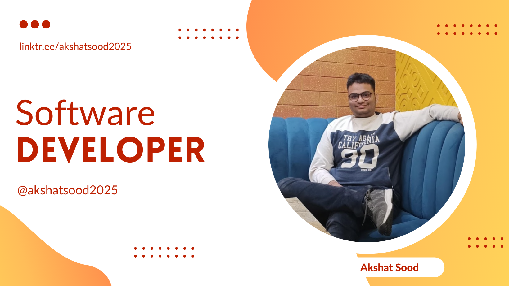

    
    
  

    
    
    
    
    
    
    

 
    
<b>Education</b> : B.Tech in Electronics Enginnering @ IIT (BHU) Varanasi (2019-Present) 

<b>Programming Languages</b>

<code></code>
<code></code>
<code></code>
<code></code>
<code></code>
<code></code>
<code></code>
<code></code>
<code></code>
<code></code>
<code></code>

<b>Frameworks and Libraries</b>

<code></code>
<code></code>
<code></code>
<code></code>
<code></code>
<code></code>
<code></code>
<code></code>
<code></code>
<code></code>
<code></code>

<b>Projects</b>

<b>Positions of Responsibility</b>
<ul>
<li>Currenty working as Software Development Intern in Engineering Development Group at MathWorks (Bangalore)</li>
<li>Coordinator of Cassandra 2022 : Data Analysis Event organized under the banner of <a href="https://www.instagram.com/udyam_iit_bhu/">UDYAM</a></li>
<li>Worked as Practice Test Paper Development Intern at <a href="https://www.edvizo.com/">Edvizo</a> during April-May (2020) contributing an extensive set of 750+ Questions in the field of Mathematics for JEE Aspirants</li>
<li>Co-Coordinator of Pixelate 2021 : Image Processing and Computer Vision Event organized under <a href="https://www.instagram.com/technexiitbhu/">Technex</a></li>
<li>Member of Core Team and Mentor at iMaze 2021 : Freshers Event organized by the Robotics Club of IIT (BHU) Varanasi</li>
</ul>

<b>Honours and Achievements</b>
<ul>
<li>Secured First Position in Cassandra 2021 : Data Analysis Event organized under the banner of <a href="https://www.instagram.com/udyam_iit_bhu/">UDYAM</a></li>
</ul>

<a href="https://www.instagram.com/akshatsood2025">-%23E4405F.svg?style=for-the-badge&logo=Instagram&logoColor=white"></a>

<a href="https://www.twitter.com/akshatsood2025">-%231DA1F2.svg?style=for-the-badge&logo=Twitter&logoColor=white"></a>

